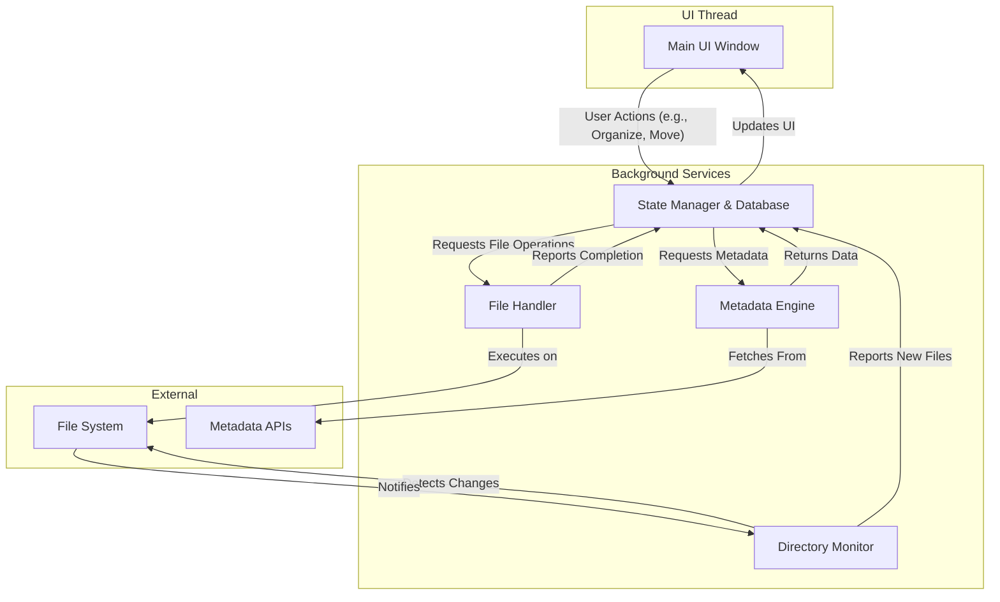

# JMAD Media Tool V2 — Consolidated Development Plan

---

## 1.0 Project Overview & Core Philosophy

### 1.1 Vision
The JMAD Media Tool V2 is a state-aware, highly customizable solution for organizing, enriching, and standardizing media files before their deployment to a live media server (e.g., Plex, Jellyfin). The goal is to replace tools like Tiny Media Manager with a more intuitive, powerful, and reliable system.

### 1.2 Core Philosophy: State-Driven Workflow
The application is built around a **State Management** philosophy. Media titles progress through a series of user-controlled states, ensuring that files are verified, correctly named, and metadata-rich before being moved. This prevents common library errors and gives the user full confidence and control over the process.

### 1.3 The Final Unified Status Protocol
This unified protocol ensures that colors have a consistent meaning across the entire application. All colors and icons are customizable via Status Color Profiles in the Appearance settings.

| Icon/Color | Status Name | Universal Meaning | Application in **Staging** | Application in **Wish List** |
| :--- | :--- | :--- | :--- | :--- |
| **⚪ Gray** | **Unorganized** | The item is new and requires initial processing or identification. | A raw, unprocessed file or folder has been detected. | A new title has been added, but no metadata search has been performed. |
| **🟡 Yellow** | **Pending Input** | An automated process was inconclusive and requires user intervention to proceed. | During organization, an ambiguous match was found (e.g., multiple possible series). | A metadata search returned multiple results, requiring the user to confirm the correct one. |
| **🔵 Blue** | **Processed** | The item has been successfully identified and structured by the user/system. | The item is correctly named and structured, ready for automated metadata enrichment. | The correct metadata ID for the title has been confirmed by the user. |
| **🟢 Green** | **Ready / Collected** | The item's goal has been met. It is either ready for its next major step or has been found. | The item is 100% enriched with metadata and artwork and is ready to be moved to the library. | The item has been successfully detected in one of the user's media libraries. |
| **🔴 Red** | **Error** | An operation has failed, or a file is in an invalid state. | A process like renaming, metadata fetching, or file moving failed. | A library item's file is detected as missing, or some other data corruption is found. |

---

## 2.0 Backend Architecture

The backend is designed as a multi-threaded Python application to ensure the user interface remains responsive while background tasks (like scanning directories, downloading metadata, and moving files) are running. Communication between the UI and background services will be handled by a thread-safe queue system.

### Component Breakdown

- **Directory Monitor Service:** Runs in a dedicated background thread, using the `watchdog` library to efficiently monitor the staging directory for any filesystem changes.
- **State Manager:** The core of the application. It tracks the state of all media items using a persistent **SQLite database**. This ensures state is safely preserved between application sessions.
- **Metadata Engine:** Handles all external API calls (e.g., TMDB, TVDB) using the `requests` library. It operates on a `ThreadPoolExecutor` to manage concurrent downloads without blocking the UI.
- **File Handler:** Executes all file system operations (`rename`, `move`, `delete`) using `os` and `shutil`. It uses a "copy-then-delete" strategy for safety and runs in a thread pool to handle multiple operations.

**Resource Management:** All background services (Metadata Engine, File Handler) will be designed to be configurable, allowing users to limit concurrent operations via the application's settings to manage system resource usage.

---

## 3.0 UI & Main Application Layout

### 3.1 Main Window
The application will feature a three-panel layout defined by a series of splitters:
- A main **horizontal splitter** divides the window into a 50/50 left and right side.
- **Left Panel (Media Tree):** The entire left side is dedicated to the media tree view.
- **Right Panel (Info/Preview & Console):** The right side contains a **vertical splitter**.
  - The top 75% of the right side is the **Info/Preview Panel**.
  - The bottom 25% of the right side is the **Console Panel**.

### 3.2 Toolbar & Menus
A standard toolbar will provide quick access to primary actions like `Scan`, `Settings`, and `Tools`. Context menus will provide item-specific actions. This will be the main navigation for the application as well switching this between the media tree and the library

### 3.3 UI Behavior Specifications

#### 3.3.1 Tree View Selection Logic
- **Single-Item Selection:** The tree view supports single-item selection with a toggle mechanism.
  - Clicking an item selects it.
  - Clicking the same item again deselects it.
  - Clicking in a blank (non-item) area of the tree view will clear any current selection.
- **Multi-Selection:** Multi-item selection using standard keyboard modifiers (e.g., `Ctrl` and `Shift`) is supported to allow organizing multiple items at once.
- **Note:** This selection behavior must not interfere with the standard double-click action to expand or collapse folders in the tree.

---

## 4.0 Core Workflow Features (First Development Milestone)

This section outlines the primary features required to deliver the complete end-to-end workflow.

### 4.1 Directory Scanning
The application will monitor the user-defined `Staging Directory`. New files will be added to the Media Tree with the `⚪ Unorganized` status.

### 4.2 The Unified Organize View (Refined Workflow)
This is the user's primary tool for converting `⚪ Unorganized` media into `🔵 Processing` media. The workflow is designed to be user-centric, providing both a manual path for precise control and an automated path for efficiency, with user confirmation required for all automated actions.

**1. Initiation & Layout:**
- The user selects one or more `Unorganized` items and opens the **Organize View**.
- The view has a clear layout:
    - **Top Toolbar:** A **Series Search** bar and a **"Search"** button for title confirmation.
    - **Source Pane (Left):** A tree view of the original, raw files and folders.
    - **Action Pane (Center):** Buttons for manual assignment (`-> Set as Season`, `-> Set as Movie`, `-> Set as Special`, `-> Set as Custom`), an **"Auto-Sort"** button, **"Undo"** and **"Redo"** buttons (initially disabled), and a `<- Remove` button.
    - **Target Pane (Right):** A tree view, initially empty, to build and verify the new structure.

**2. Workflow Steps:**

*   **Step 1: Series Confirmation (Mandatory)**
    *   Upon opening, the application will attempt to guess the series title from the selected folder name(s) and pre-populate the search bar.
    *   The user can then confirm or edit this guess and use the **"Search"** button to find and lock in the correct media title (e.g., from TMDB). This provides the base `[Series Name]` for all renaming operations.

*   **Step 2: Organization (Manual or Automated Path)**

    *   **A) Manual Path (Precise Control):**
        1.  The user can either use the **Action Pane buttons** or intuitive **drag-and-drop** gestures to organize items.
        2.  **Via Buttons (File-based):** If the user selects one or more individual files in the Source Pane and clicks an action button (e.g., `-> Set as Season`), a new folder representing that season is created in the Target Pane, and the selected files are moved and renamed under it.
        3.  **Via Buttons (Folder-based):** If the user selects a single folder in the Source Pane and clicks an action button, the folder itself is moved to the Target Pane and transformed (e.g., renamed to 'Season 01'), with its contents renamed accordingly.
        4.  **Target Pane Behavior:** The Target Pane will display two columns: "Original Name" and "New Name". The "New Name" column will be editable, allowing the user to make manual adjustments to the proposed new filenames before finalizing.
        5.  **Via Drag-and-Drop:** Drag a file or folder from the Source Pane and drop it onto the Target Pane. A context menu will appear on drop, allowing the user to choose the assignment (e.g., "Assign as Season").

    *   **B) Automated Path (Efficient Suggestions):**
        1.  The user clicks the **"Auto-Sort"** button.
        2.  This opens an **"Auto-Sort Plan"** confirmation dialog. The dialog displays a scrollable list of all groupings the application has identified, each with a checkbox.
            - *Example: `[✓] Propose creating 'Season 01' from folder 'Show.S01.1080p' (12 files)`*
        3.  A **"Select/Deselect All"** checkbox is provided for convenience.
        4.  The user reviews the plan, unchecking any incorrect proposals.
        5.  Upon clicking **"Apply Selections"**, only the approved groupings are moved from the Source Pane to the Target Pane. Any un-checked items remain in the Source Pane for manual sorting.

*   **Step 3: Verification and Finalization**
    *   The user reviews the complete proposed structure in the **Target Pane**.
    *   Corrections can be made easily: simply drag an incorrect item from the Target Pane and drop it back into the Source Pane to revert it.
    *   Once satisfied, the user clicks **"Process Files"**. This executes the file operations on disk, transitions the media's status to `🔵 Processing`, and closes the dialog.

**Structuring Rules for this Stage:**
- **Episodes:** Are structured simply (e.g., `Series Name - S01E01.mkv`).
- **Series-Related Movies:** Are placed in a dedicated `Movies` sub-folder: `[Series Name]/Movies/[Movie Name (Year)]/[Movie Name (Year)].mkv`.

### 4.3 Automated Processing (Blue -> Green)
Once media is in the `🔵 Processing` state, the user can trigger this fully automated step. The application will:
1.  Fetch all metadata (NFO files, posters, fanart, etc.) from the user's configured sources.
2.  Apply the user's final, complex **renaming patterns** defined in the application's settings.
3.  Upon completion, transition the media to the `🟢 Ready to Move` state.

### 4.4 Move to Library
The user can select any `🟢 Ready to Move` item and trigger this action, which will safely move the files and their accompanying metadata to the correct folder in the live library.

---

## 5.0 Settings (Finalized Structure)

The Settings window is a comprehensive dialog using a tabbed interface for persistent configuration, saved within the `config` directory.

### 5.1 General Tab
- **Header: System Behavior**
  - `[ ] Start with Windows`
  - `[ ] Minimize to System Tray`
  - `[ ] Show notification pop-ups for background tasks`

### 5.2 Directories Tab
- **Staging Directory:** An absolute path to the folder where new, unorganized media is placed.
- **Library Destinations:** Configuration for final destination folders, including Name, Path, and prioritized Metadata Providers.

### 5.3 Renaming Tab
- Configuration for title cleaning patterns and file/folder naming templates.

### 5.4 Metadata Tab
- Configuration for provider API keys, media server preferences, and artwork settings.

### 5.5 Libraries Tab
- Configuration for automated library scanning (on startup, scheduled).

### 5.6 Cleaning Tab
- Configuration for the default behavior of the Cleaning Tool.

### 5.7 Trash Bin Tab
- Configuration for enabling the trash bin and auto-purging rules.

### 5.8 Appearance Tab (New)
- Configuration for the application's visual theme, status colors, and layout.

### 5.9 Hotkeys Tab (New)
- A view to display and customize keyboard shortcuts for all major application actions.

### 5.10 Performance Tab
- Sliders/inputs for limiting concurrent operations, memory, and CPU usage.

---

## 6.0 Core Features (Post-Milestone 1 Detailed Plan)

### 6.1 Libraries & Wish List
This feature provides a comprehensive, searchable view of the user's live libraries and a powerful tool for tracking desired media.

#### 6.1.1 UI & Interaction
- **Main View:** A new top-level tab/view selector to switch between the "Staging" area and the "Libraries" area.
- **Wish List Sub-Tab:** The primary tab within the Libraries view. Displays a list of desired media titles with columns for Status, Title, Year, and a notes field.
  - **Action Buttons:** `Import...`, `Export...`, `Add New...`, `Remove`, `Fetch Metadata`.
  - **Contextual Logic:** `Fetch` and `Remove` buttons operate on selected items, or all eligible items if nothing is selected.
  - **Duplicate Prevention:** The system will check for duplicates when adding a title and notify the user.
- **Dynamic Library Sub-Tabs:** Additional tabs are created automatically for each library defined in Settings.
  - **Display:** Shows a list of media within that library, including Title, Year, and a Status/Flag column.
  - **Interaction:** Right-clicking a title provides an "Open file location" option.
- **Flagging System:**
  - **Full Row Coloration:** The entire row of a media title will be colored to indicate its status.
  - **Icons:** A dedicated column will show icons for specific states.
  - **Customization:** All colors and icons are user-customizable in Settings.

#### 6.1.2 Wish List Workflow & States
1.  ⚪ **New:** A title is added manually or via the import/extension. Row color is neutral.
2.  🟡 **Pending Confirmation:** After the user runs the `Fetch Metadata` action, the app finds potential matches, and the row turns **Yellow**. The user must open a dialog to confirm the correct media ID from a list of search results.
3.  🔵 **Confirmed:** The user confirms the correct ID. The row turns **Blue**.
4.  🟢 **Collected:** The Library Scanner detects the title is now in a library. The row turns **Green**, and the UI indicates which library it's in. The user can then use the `Remove` button to clean up their Wish List.

#### 6.1.3 Library Scanner
- A background process that can be run manually or on a schedule.
- **Functionality:**
  - Scans library folders to populate the dynamic library tabs.
  - Cross-references library contents with the Wish List to flag items as `Collected`.
  - **(Advanced)** Detects series with missing episodes and flags them accordingly.

#### 6.1.4 Future Integrations
- **Chrome Extension:** A browser extension to add titles directly to the Wish List.

### 6.2 Cleaning Tool
A powerful utility to safely remove unwanted files from the staging directory.

#### 6.2.1 Dual-Mode Operation
- **1. Quick Clean:** An action (e.g., toolbar button) that uses the saved settings to clean files. It is context-aware:
  - *If items are selected:* Cleans only within those selections.
  - *If no items are selected:* Cleans the entire staging directory.
- **2. Advanced Clean:** Opens a dedicated dialog for a safe, review-driven cleaning session.

#### 6.2.2 Advanced Clean Dialog
- **Context-Aware Scope:** The "Scan" button in the dialog respects the main window's selection (selected items vs. entire directory).
- **Workflow:**
  1.  **Configure:** The dialog opens with default categories pre-selected, which the user can override for the session.
  2.  **Scan:** The user initiates a scan.
  3.  **Review:** The dialog's console displays a detailed list of all files that will be removed.
  4.  **Execute:** The user confirms the action, and the files are moved to the trash or deleted.

#### 6.2.3 Cleaning Categories
Users can select from logical groups of file types:
- **Text & Information Files** (`.txt`, `.nfo`, etc.)
- **Unwanted Artwork** (`.jpg`, `.png`, etc.)
- **External Subtitle Files** (`.srt`, `.ass`, etc.)
- **Sample & Trailer Files** (Based on file size and name heuristics)
- **Custom File Types** (User-defined list of extensions)

### 6.3 Trash Bin & Smart Restore
An intelligent, context-aware recovery tool that acts as a safety net for all file operations.

#### 6.3.1 UI & Interaction
- **Main View:** A dedicated "Trash Bin" view, accessible from the main toolbar.
- **Toolbar:** Contains `Search` and `Filter` controls, along with action buttons: `Restore`, `Move To...`, and `Empty Trash`.
- **Display:** A tree view displays deleted files, nested under their original parent folder structure to provide context.
- **Live Counter:** A status bar at the bottom shows the total disk space occupied by the trashed files (e.g., "Total Size: 4.2 GB").

#### 6.3.2 Core Functionality
- **Smart Restore:** The primary restore method. When a user restores a file, the application intelligently determines the *current* path of the parent media item, even if it has been renamed or moved since the file was deleted. It then restores the file to this new, correct location, preserving any original sub-folder structure.
  - **Architectural Note:** This requires the database to maintain a persistent link between a trashed file and its logical parent media item.
- **Move To...:** A manual override that allows the user to select a file from the trash and restore it to any arbitrary location on the filesystem via a folder picker dialog.

### 6.4 Appearance & Hotkeys (New)
This section details the features for advanced user interface customization and control.

#### 6.4.1 Appearance Editor
- **Functionality:** Provides deep customization of the application's look and feel, managed via a dedicated "Appearance" tab in the Settings window.
- **Application Theme:** A top-level selector for the base application theme (`Light`, `Dark`, `Use System Setting`) and font size (`Small`, `Normal`, `Large`).
- **Status Color Profiles:** The core of the feature. Users can customize the colors for all workflow and status indicators (e.g., `Unorganized`, `Ready to Move`, `Wish List Collected`).
  - These color sets can be saved as named profiles (e.g., "Default", "High Contrast").
  - The application will ship with default profiles (specific color hexes to be provided).
- **Layout Persistence:** The application will automatically save and restore the user's custom panel sizes and window position between sessions.

#### 6.4.2 Global Hotkey System
- **Functionality:** Provides customizable keyboard shortcuts for most major actions to improve workflow speed for power users.
- **Configuration:** A new "Hotkeys" tab in the Settings window will list all mappable actions alongside a field for assigning a custom key combination.
- **Default Hotkeys:** The application will ship with a set of sensible default hotkeys, as outlined in the table below.

| Action | Default Hotkey |
| :--- | :--- |
| Open Settings | `Ctrl + ,` |
| Open Trash Bin | `Ctrl + T` |
| Focus Search Bar | `Ctrl + F` |
| Scan Staging Directory | `F5` |
| Switch to Staging View | `Ctrl + 1` |
| Switch to Libraries View | `Ctrl + 2` |
| Open Organize View | `Ctrl + O` |
| Rename Item | `F2` |
| Send to Trash | `Delete` |
| Move to Library | `Ctrl + M` |
| Quick Clean | `Ctrl + Shift + C` |
| Select All | `Ctrl + A` |
| Deselect All | `Escape` |

### 6.5 Future V3.0+ Considerations
- **Plugin & Extension Support:** A placeholder for a future, large-scale project to allow third-party developers to extend application functionality.

---

## 8.0 Milestone 1: Implementation Roadmap (V2.0)

This roadmap breaks the first development milestone into sequential phases, ensuring a structured build process from the ground up.

### **Phase 1: Foundation & UI Shell**
*   **1.1. Project Scaffolding:** Set up the complete project structure, install initial dependencies (e.g., `PySide6`, `watchdog`, `requests`), and establish the main application entry point (`main.py`).
*   **1.2. Main Window Construction:** Build the primary application window, implementing the three-panel layout (Media Tree, Info/Preview, Console) with draggable splitters for resizing.
*   **1.3. Toolbar & Menus:** Implement the main toolbar with functional (but initially basic) buttons for "Scan," "Settings," etc., and create the top-level menu structure.
*   **1.4. Database Initialization:** Create the initial `SQLite` schema and a database manager class to handle all connections and queries, ensuring state can be persisted from the very beginning.
*   **1.5. Placeholder Assets:** Integrate placeholder artwork and metadata to ensure the UI is polished even when empty. Standard artwork sizes to be used:
    *   **Poster:** 1000x1500px
    *   **Fanart/Background:** 1920x1080px
    *   **Episode Thumbnail:** 1920x1080px

### **Phase 2: Directory Scanning & State Display**
*   **2.1. Directory Monitor Service:** Implement the background service using `watchdog` to monitor the staging directory for new, modified, or deleted files.
*   **2.2. State Manager Integration:** Implement the core `State Manager` logic. When the monitor detects new files, the State Manager will add them to the database with the `⚪ Unorganized` status.
*   **2.3. Populate Media Tree:** Connect the database to the UI. The Media Tree will now populate with all items from the database, displaying their respective status (initially, all will be `Unorganized`).
*   **2.4. Tree View Interaction:** Implement the specified single-item selection and deselection logic in the Media Tree.

### **Phase 3: The Unified Organize View**
*   **3.1. Dialog Creation:** Build the `Organize View` dialog window, laying out the Source, Action, and Target panes.
*   **3.2. Series Search:** Implement the series search bar, which will call the Metadata Engine to fetch and confirm the media title from an external API (e.g., TMDB).
*   **3.3. Manual Sorting:** Implement the manual assignment workflow using both the action buttons (`-> Set as Season`, etc.) and the drag-and-drop functionality between the Source and Target panes.
*   **3.4. Automated Sorting:** Implement the "Auto-Sort" button, the "Auto-Sort Plan" confirmation dialog, and the logic to move approved items to the Target pane.
*   **3.5. Finalize Organization:** Implement the "Process Files" button logic. This will trigger the `File Handler` to perform the actual file operations on disk and update the items' status to `🔵 Processing` in the database.

### **Phase 4: Automated Enrichment & Deployment**
*   **4.1. Metadata Engine:** Fully implement the `Metadata Engine` to download NFO files and artwork for all items in the `🔵 Processing` state.
*   **4.2. Final Renaming:** Implement the logic that applies the user-defined complex renaming patterns to the files.
*   **4.3. Update State to "Ready":** Once enrichment and renaming are complete, update the items' status to `🟢 Ready to Move`.
*   **4.4. Move to Library:** Implement the final "Move to Library" action, which will safely transfer the fully processed files and their metadata to the user's designated library folder.

### **Phase 5: Settings & Finalization**
*   **5.1. Settings Window:** Build the user settings window.
*   **5.2. Implement Settings Logic:** Connect the UI to the backend to allow users to configure directories, renaming patterns, API keys, and the resource limits for concurrent operations.
*   **5.3. Final Review:** Conduct thorough testing of the end-to-end workflow, fix bugs, and prepare for the initial release.